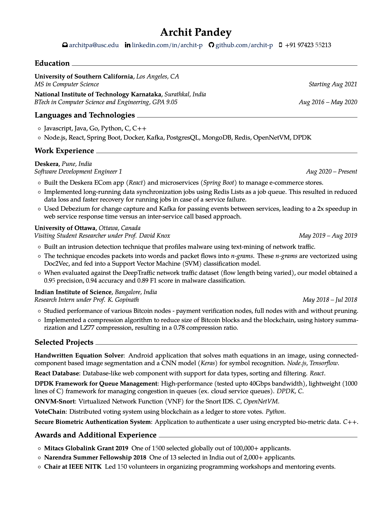

Software developer resume using Latex for markup, and versioned deploys to GitHub Releases using Actions.

## Features
* Single-column layout
* One-page template, perfect for an early-career resume
* Sections: Education, Languages and Technologies, Work Experience, Projects, Awards and Additional Experience
* PDF generated on each push
* Versioned PDFs organized in GitHub Releases

## Getting Started
### Clone
```
git clone https://github.com/archit-p/resume
```
### Editing
Use your favorite Latex editor to edit the resume content.
* [TeXStudio](https://www.texstudio.org)
* [MacTeX](http://www.tug.org/mactex/)
* [Overleaf](https://overleaf.com)
### Releasing
Once satisfied with the changes, create a new tag. Doing so will create a new release and upload the resume PDF there.
```
git tag <version-number>
git push origin <version-number>
```

## Preview


## License
Template and actions are MIT licensed, content is owned by Archit Pandey.
